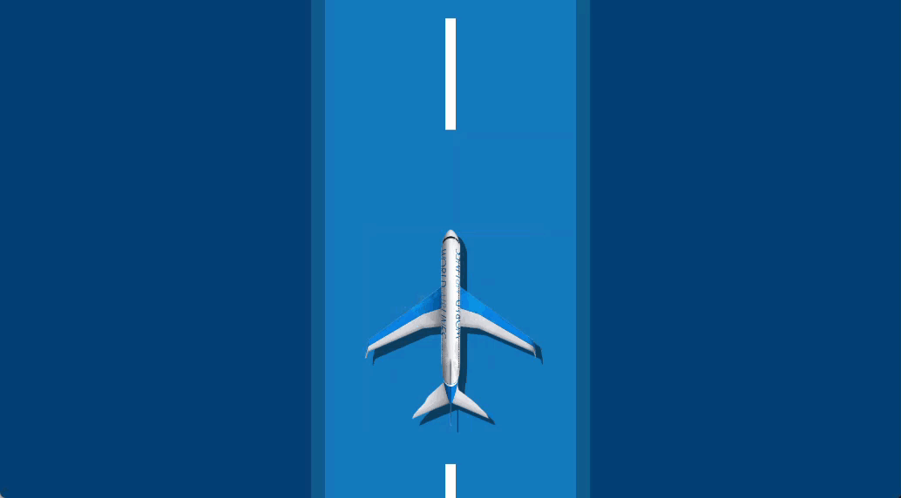

# Animated Airplane takeoff and landing using HTML/CSS

>Fly and Land an Airplane using HTML/CSS. 



To takeoff: hold your mouse down. 

To land: release your mouse. 

## Demo
## Quick Start

```bash
# Live Server
http://127.0.0.1:5500/index.html

# index.html
Double click on index.html file to view in browser
```